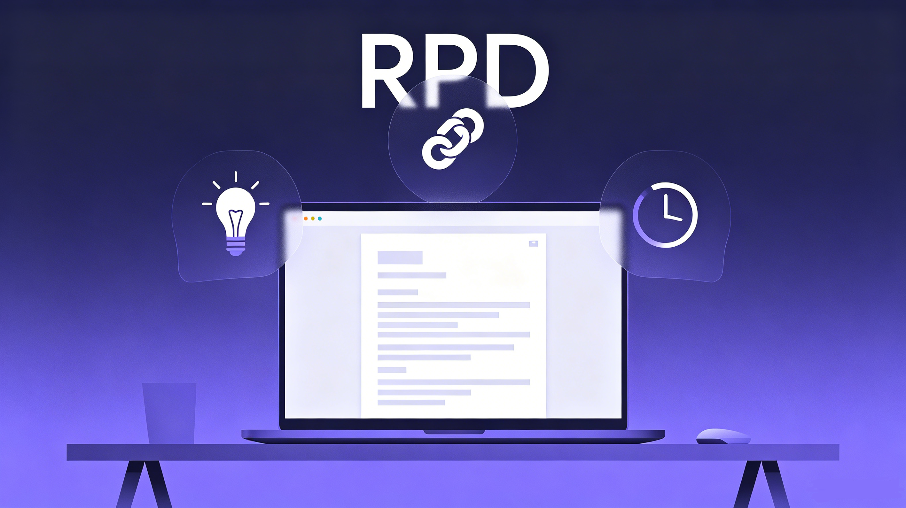
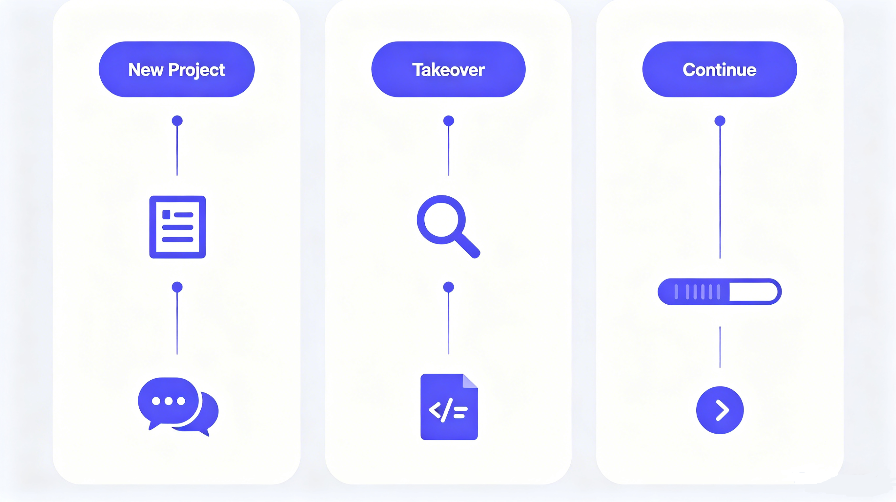
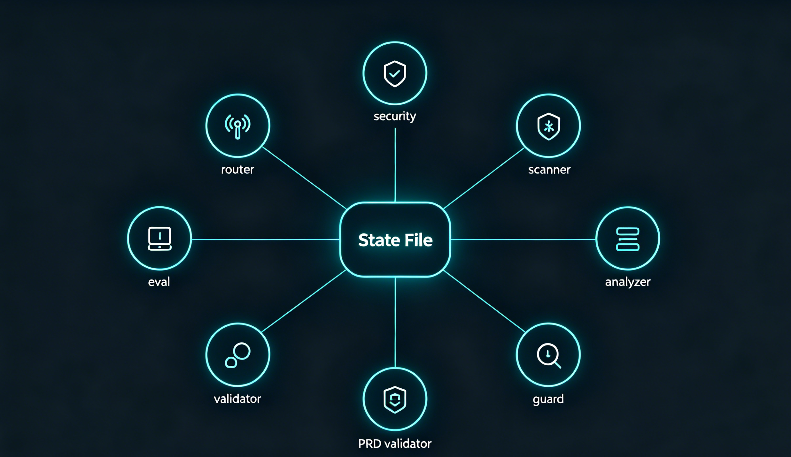

<h1 align="center">RPD — Rapid Product Document</h1>

<p align="center">
  <strong>给你的 AI 编程项目装上"记忆"，不会每次开新对话就失忆。</strong>
  <br />
  <em>Give your Vibe Coding project "memory" — no more amnesia across conversations.</em>
</p>

<p align="center">
  <a href="https://github.com/ZhangJing-gugugaga/RPD-Skill"></a>
  <a href="#installation--安装2-minutes"></a>
  <a href="#scripts--脚本工具箱"></a>
  <a href="#hard-constraints--硬性红线"></a>
  <a href="https://github.com/ZhangJing-gugugaga/RPD-Skill"></a>
  <a href="#eval-matrix"></a>
</p>

<p align="center">
  <a href="#english">English</a> | <a href="#中文版">中文版</a>
</p>

<p align="center">
  
</p>

---

# English

## What Problem Does RPD Solve?

You're Vibe Coding with AI. Three things kill your project:

| Breakpoint | What Happens | RPD's Fix |
|------------|--------------|-----------|
| **Requirement Fracture** | "I want to build an App" -> 3 days later, direction is wrong | Three-perspective diagnosis -> Concept PRD -> Scope freeze |
| **Context Fracture** | Switch AI conversation, it knows nothing about your project | `.project-state.md` state file, cross-session memory |
| **Time Fracture** | Come back after 2 weeks, forgot why chose SQLite | Key decision records + decision drift detection |

**One sentence: RPD gives your project "memory" so every new AI conversation picks up where you left off.**

---

## Key Features

| Feature | Description | How It Works |
|---------|-------------|--------------|
| Three-perspective diagnosis | User / Business / Technical perspectives, max 3 questions per round | `intent-router.py` determines maturity, routes to appropriate flow |
| Two-tier PRD | Concept PRD (<=200 words) for alignment, Full PRD for development | Concept PRD -> user confirm -> scope freeze -> full PRD |
| Security hard block | 8 business security rules (SEC-001~008), function-level detection | `security-scanner.py` scans code, exit code 2 blocks on findings |
| State file | `.project-state.md` with subtask-level progress tracking | `state-validator.py` validates schema, `state-guard.py` handles writes |
| Decision drift detection | Detects when code diverges from documented decisions | `gap-analyzer.py` compares PRD vs actual codebase |
| Deterministic routing | `intent-router.py` classifies intent without LLM guessing | Rule-based classification, no token consumption |
| Path traversal protection | Blocks `../` and symlink escape attacks | `verify_path_safety()` validates all file paths |
| PRD completeness validation | Script checks for missing error handling, state machines, field specs | `prd-validator.py` scans for gaps, exit code 2 on missing sections |
| Atomic state updates | Backup + atomic write + validation + auto-rollback | `state-guard.py` manages file operations safely |
| Bilingual | All prompts, templates, and outputs in Chinese and English | Language detection from first message,全程跟随 |

---

## How It Works

<p align="center">
  
</p>

### Flow A: New Project

> **Trigger:** "I want to build..."

```
User Input
    |
    v
intent-router.py (classify intent + maturity)
    |
    +---> Standard mode (clear requirements)
    |         |
    |         v
    |     Three-perspective diagnosis (max 3 Q/round)
    |         |
    |         v
    |     Concept PRD (<=200 words) --> User confirm
    |         |
    |         v
    |     Scope freeze --> Full PRD
    |         |
    |         v
    |     Generate .project-state.md
    |
    +---> Beginner mode (vague idea)
              |
              v
          Scene Exploration Mode (3 casual rounds)
              |
              v
          Concept PRD in plain language
              |
              v
          Skip standard diagnosis
```

### Flow B: Takeover Half-Finished

> **Trigger:** "Take over this project"

```
User Input
    |
    v
security-scanner.py (hard block if secrets found)
    |
    v
project-scanner.py (tech stack, components, API routes)
    |
    v
Confirm inference with user
    |
    v
Generate PRD + .project-state.md
```

### Flow C: Continue Development

> **Trigger:** "Continue development"

```
User Input
    |
    v
security-scanner.py + state-validator.py
    |
    v
gap-analyzer.py (PRD vs code + decision drift)
    |
    v
Action plan + next steps
    |
    +---> Review mode (inactive >3 days)
              |
              v
          PRD summary + feature status
              |
              v
          Ask: "continue or revise?"
```

---

## Installation (2 minutes)

| Step | Action | Command |
|------|--------|---------|
| 1 | Find your skills directory | `your-project/.claude/skills/rpd/` (project) or `~/.claude/skills/rpd/` (global) |
| 2 | Copy files | `cp -r skills/rpd /your/project/.claude/skills/rpd` |
| 3 | Verify | Say "I want to build a personal finance tracker" in Claude Code |

**Verification:**
- If Claude asks "Who is the target user?" -> Skill is active.
- If Claude starts coding immediately -> Not installed, check path.

---

## Trigger Words

| You Say | RPD Does | Script |
|---------|----------|--------|
| "I want to build..." | Flow A: New Project | `intent-router.py` |
| "Take over this project" | Flow B: Takeover | `security-scanner.py` + `project-scanner.py` |
| "Continue development" | Flow C: Continue | `gap-analyzer.py` |
| "Quick mode" / "Simple version" | Turbo Mode (minimal output) | `intent-router.py` |
| "Review" / "What was done before" | Review Mode | `state-validator.py` |

---

## Scripts

<p align="center">
  
</p>

8 Python scripts, **zero dependencies, stdlib only**:

| Script | Purpose | Exit Codes | Auto-triggered |
|--------|---------|------------|----------------|
| `intent-router.py` | Deterministic intent classification | 0=success, 1=error | Every conversation start |
| `security-scanner.py` | 8 SEC rules + path traversal + prompt injection | 0=clean, 1=error, 2=blocked | Flow B/C start |
| `project-scanner.py` | Tech stack, components, API routes | 0=success, 1=error | Flow B |
| `gap-analyzer.py` | PRD vs code gap + decision drift detection | 0=success, 1=error | Flow C |
| `state-validator.py` | State file JSON Schema validation | 0=valid, 1=error, 3=invalid | After state changes |
| `state-guard.py` | Backup + atomic write + Git concurrency check | 0=success, 3=file missing, 4=conflict | Before state updates |
| `prd-validator.py` | PRD completeness (error handling, state machines) | 0=complete, 1=error, 2=gaps found | After PRD generation |
| `run-eval.py` | 11 evaluation scenarios | 0=all pass, 1=some fail | Development/testing |

> **You don't need to run these manually.** Claude calls them automatically.

---

## Hard Constraints

These rules are **absolutely non-negotiable** during execution:

| # | Rule | Enforcement |
|---|------|-------------|
| 1 | Security scan cannot be skipped | exit code 2 hard block |
| 2 | State validation cannot be skipped | exit code 3 rollback |
| 3 | Max 3 questions per round | Text constraint |
| 4 | Don't skip concept PRD | Text constraint |
| 5 | Don't overwrite without backup | `state-guard.py` |
| 6 | No path traversal | `verify_path_safety()` |

---

## Security Rules

| Rule ID | Name | Severity | Detection Pattern |
|---------|------|----------|-------------------|
| SEC-001 | SMS/Email API without rate limiting | CRITICAL | `sendSMS()`, `sendEmail()` without `rateLimit` |
| SEC-002 | UGC write without content moderation | CRITICAL | `Comment.create()` without `contentModerat` |
| SEC-003 | File upload without type validation | HIGH | `multer()` without `fileFilter` |
| SEC-004 | File storage on local disk | MEDIUM | `diskStorage()` usage |
| SEC-005 | Hardcoded System Prompt | HIGH | `SYSTEM_PROMPT = "..."` in code |
| SEC-006 | Direct file URL without access control | MEDIUM | `res.json({url: ...})` without signed URL |
| SEC-007 | API route without authentication middleware | HIGH | `router.get("/api/...")` without `auth` |
| SEC-008 | System Prompt via string concatenation | LOW | `SYSTEM_PROMPT = var + "..."` |

---

## State File Example

`.project-state.md` records everything the AI needs to resume:

```markdown
---
name: my-app
state_revision: 3
---

## Feature Progress
| Feature | Subtask | Priority | Status | Notes |
|---------|---------|----------|--------|-------|
| User Login | Form submit | P0 | DONE | |
| User Login | OAuth integration | P0 | IN_PROGRESS | 70% |

## Key Decisions
| Date | Type | Decision | Reason | Impact |
|------|------|----------|--------|--------|
| 06-03 | Tech stack | Use SQLite | Single machine deploy | Data layer global |

## Diagnosis Log
| Round | Perspective | Question | User Answer |
|-------|-------------|----------|-------------|
| R1 | User | Who is the target user? | Independent developer |
```

---

## Eval Matrix

11 evaluation scenarios covering all core functionality:

| Scenario | Name | What It Tests |
|----------|------|---------------|
| A | Empty Project | State file not found handling |
| B | Corrupted State File | Schema validation rejection |
| C | Prompt Injection | Security scanner blocks injection |
| D | Half-Finished Project | Tech stack detection (React+Vite) |
| E | Intent Router | 7 intent classification test cases |
| F | PRD Validator | PRD completeness checks |
| G | Decision Drift | 3 drift levels (none/MEDIUM/HIGH) |
| H | State Guard | Backup/cleanup operations |
| I | SEC Rules | 4 security rule detection tests |
| O | Chinese Name | Chinese project name support |
| P | Turbo Mode | Vague input routing |

---

## FAQ

| Question | Answer |
|----------|--------|
| Do I need to memorize trigger words? | No. Just speak naturally. `intent-router.py` classifies your intent deterministically. |
| What if I run out of tokens? | Turbo mode activates: skip concept PRD, minimal output format, security scan still runs (no tokens). |
| Can I modify PRD mid-project? | Yes. Changing core features requires re-freeze scope. Concept PRD revised >3 times -> user research suggested. |
| What if state file conflicts? | `state-guard.py` checks Git concurrency before writing. If conflict detected (UU), it blocks with exit code 4. |
| Can I use RPD with non-Node.js projects? | Yes. The scripts scan for general patterns. Framework-specific detection works best for React/Vue/Express. |

---

## Directory Structure

```
rpd/
├── .claude-plugin/
│   └── plugin.json
├── SKILL.md                    # Main control instructions (bilingual)
├── README.md                   # This file
├── scripts/
│   ├── intent-router.py        # Intent classification
│   ├── security-scanner.py     # Security scanning
│   ├── project-scanner.py      # Tech stack detection
│   ├── gap-analyzer.py         # PRD vs code comparison
│   ├── state-validator.py      # State file validation
│   ├── state-guard.py          # State file operations
│   ├── prd-validator.py        # PRD completeness check
│   └── run-eval.py             # Evaluation runner
├── references/
│   ├── prd-template.md         # PRD template
│   └── state-schema.json       # State file JSON Schema
├── eval/
│   └── scenarios/              # 11 evaluation scenarios
├── images/
│   ├── hero.png                # Hero image
│   ├── workflow.png            # Workflow diagram
│   └── architecture.png        # Architecture diagram
└── assets/
    └── example-state.md        # Example state file
```

---

<p align="center">
  <strong>RPD is not omnipotent. It can't make product decisions, write code, or raise funding.</strong>
  <br />
  <strong>What it can do: give your project memory, keep direction on track, save your tokens.</strong>
</p>

---

# 中文版

<p align="center">
  
</p>

## RPD 解决什么问题？

你在用 AI 做 Vibe Coding。有三件事会杀死你的项目：

| 死法 | 症状 | 解药 |
|------|------|------|
| **需求断裂** | "我想做一个 App" -> 3 天后，方向跑偏了 | 三视角诊断 -> 概念版 PRD -> 范围冻结 |
| **上下文断裂** | 换个 AI 对话，它完全不知道你的项目 | `.project-state.md` 状态文件，跨会话记忆 |
| **时间断裂** | 两周后回来，忘了当初为什么选 SQLite | 关键决策记录 + 决策漂移检测 |

**一句话：RPD 让项目有记忆，每次开新 AI 对话都能接上。**

---

## 功能特性

| 功能 | 描述 | 工作原理 |
|------|------|----------|
| 三视角诊断 | 用户/商业/技术三个视角，每轮最多 3 个问题 | `intent-router.py` 判断成熟度，路由到对应流程 |
| 两级 PRD | 概念版 PRD（<=200 字）快速对齐，落地版 PRD 指导开发 | 概念版 PRD -> 用户确认 -> 范围冻结 -> 落地版 PRD |
| 安全硬阻断 | 8 条业务安全规则（SEC-001~008），函数级检测 | `security-scanner.py` 扫描代码，exit code 2 硬阻断 |
| 状态文件 | `.project-state.md` 支持子任务级进度追踪 | `state-validator.py` 校验 schema，`state-guard.py` 管理写入 |
| 决策漂移检测 | 检测代码是否偏离了文档记录的决策 | `gap-analyzer.py` 对比 PRD 与实际代码库 |
| 确定性路由 | `intent-router.py` 分类意图，不依赖 LLM 猜测 | 基于规则的分类，零 token 消耗 |
| 路径遍历防护 | 阻止 `../` 和符号链接逃逸攻击 | `verify_path_safety()` 校验所有文件路径 |
| PRD 完整性校验 | 脚本检查缺失的错误处理、状态机、字段规范 | `prd-validator.py` 扫描缺失项，exit code 2 表示有缺口 |
| 原子化状态更新 | 备份 + 原子写入 + 校验 + 自动回滚 | `state-guard.py` 安全管理文件操作 |
| 中英双语 | 所有提示词、模板、输出支持中英文 | 从首条消息检测语言，全程跟随 |

---

## 工作流程

<p align="center">
  
</p>

### 流程 A：新项目

> **触发词：** "我想做一个……"

```
用户输入
    |
    v
intent-router.py（分类意图 + 成熟度）
    |
    +---> 标准模式（需求明确）
    |         |
    |         v
    |     三视角诊断（每轮最多 3 个问题）
    |         |
    |         v
    |     概念版 PRD（<=200 字）--> 用户确认
    |         |
    |         v
    |     范围冻结 --> 落地版 PRD
    |         |
    |         v
    |     生成 .project-state.md
    |
    +---> 新手模式（想法模糊）
              |
              v
          场景探索模式（3 轮轻松对话）
              |
              v
          用大白话生成概念版 PRD
              |
              v
          跳过标准诊断
```

### 流程 B：接手半成品

> **触发词：** "接手这个项目"

```
用户输入
    |
    v
security-scanner.py（发现密钥则硬阻断）
    |
    v
project-scanner.py（技术栈、组件、API 路由）
    |
    v
与用户确认推断结果
    |
    v
生成 PRD + .project-state.md
```

### 流程 C：继续开发

> **触发词：** "继续开发"

```
用户输入
    |
    v
security-scanner.py + state-validator.py
    |
    v
gap-analyzer.py（PRD vs 代码 + 决策漂移）
    |
    v
行动计划 + 下一步
    |
    +---> 回顾模式（停顿 >3 天）
              |
              v
          PRD 摘要 + 功能状态
              |
              v
          询问："继续还是修改？"
```

---

## 安装（2 分钟）

| 步骤 | 操作 | 命令 |
|------|------|------|
| 1 | 找到 skills 目录 | `your-project/.claude/skills/rpd/`（项目级）或 `~/.claude/skills/rpd/`（全局级） |
| 2 | 复制文件 | `cp -r skills/rpd /your/project/.claude/skills/rpd` |
| 3 | 验证 | 在 Claude Code 中说"我想做一个记账 App" |

**验证方法：**
- 如果 Claude 问"目标用户是谁？" -> 插件已激活。
- 如果 Claude 直接开始写代码 -> 未安装成功，检查路径。

---

## 触发词

| 你说的 | RPD 做的 | 脚本 |
|--------|----------|------|
| "我想做一个……" | 流程 A：新项目 | `intent-router.py` |
| "接手这个项目" | 流程 B：接手半成品 | `security-scanner.py` + `project-scanner.py` |
| "继续开发" | 流程 C：继续开发 | `gap-analyzer.py` |
| "快一点" / "简单点" | Turbo 模式（最小输出） | `intent-router.py` |
| "回顾" / "之前做了什么" | 回顾模式 | `state-validator.py` |

---

## 脚本工具箱

<p align="center">
  
</p>

8 个 Python 脚本，**零依赖，纯标准库**：

| 脚本 | 用途 | 退出码 | 自动触发时机 |
|------|------|--------|-------------|
| `intent-router.py` | 确定性意图分类 | 0=成功, 1=错误 | 每次对话开始 |
| `security-scanner.py` | 8 条 SEC 规则 + 路径遍历 + 提示词注入 | 0=安全, 1=错误, 2=硬阻断 | 流程 B/C 开始 |
| `project-scanner.py` | 技术栈、组件、API 路由 | 0=成功, 1=错误 | 流程 B |
| `gap-analyzer.py` | PRD vs 代码差距 + 决策漂移检测 | 0=成功, 1=错误 | 流程 C |
| `state-validator.py` | 状态文件 JSON Schema 校验 | 0=有效, 1=错误, 3=无效 | 状态变更后 |
| `state-guard.py` | 备份 + 原子写入 + Git 并发检查 | 0=成功, 3=文件不存在, 4=冲突 | 状态更新前 |
| `prd-validator.py` | PRD 完整性（错误处理、状态机） | 0=完整, 1=错误, 2=有缺口 | PRD 生成后 |
| `run-eval.py` | 11 个评估场景 | 0=全部通过, 1=部分失败 | 开发/测试 |

> **你不需要手动运行。** Claude 会在对应流程中自动调用。

---

## 硬性红线

以下规则在执行过程中**绝对不可违反**：

| # | 规则 | 强制执行方式 |
|---|------|-------------|
| 1 | 安全扫描不可跳过 | exit code 2 硬阻断 |
| 2 | 状态校验不可跳过 | exit code 3 回滚 |
| 3 | 每轮最多 3 个问题 | 文本约束 |
| 4 | 不可跳过概念版 PRD | 文本约束 |
| 5 | 不可无备份覆盖 | `state-guard.py` |
| 6 | 不可路径遍历 | `verify_path_safety()` |

---

## 安全规则

| 规则 ID | 名称 | 严重程度 | 检测模式 |
|---------|------|----------|----------|
| SEC-001 | 短信/邮件发送接口缺少频率限制 | CRITICAL | `sendSMS()`、`sendEmail()` 无 `rateLimit` |
| SEC-002 | 用户生成内容(UGC)写入无审核机制 | CRITICAL | `Comment.create()` 无 `contentModerat` |
| SEC-003 | 文件上传缺少文件类型校验 | HIGH | `multer()` 无 `fileFilter` |
| SEC-004 | 文件存储在服务器本地磁盘 | MEDIUM | 使用 `diskStorage()` |
| SEC-005 | AI System Prompt 硬编码在代码中 | HIGH | 代码中 `SYSTEM_PROMPT = "..."` |
| SEC-006 | 文件URL直接可访问，无防盗链保护 | MEDIUM | `res.json({url: ...})` 无签名 URL |
| SEC-007 | API 路由缺少认证中间件 | HIGH | `router.get("/api/...")` 无 `auth` |
| SEC-008 | AI System Prompt 通过字符串拼接构造 | LOW | `SYSTEM_PROMPT = var + "..."` |

---

## 状态文件示例

`.project-state.md` 记录了 AI 恢复工作所需的一切：

```markdown
---
name: my-app
state_revision: 3
---

## 功能进度清单
| 功能 | 子任务 | 优先级 | 状态 | 备注 |
|------|--------|--------|------|------|
| 用户登录 | 表单提交 | P0 | 已完成 | |
| 用户登录 | OAuth对接 | P0 | 进行中 | 70% |

## 关键决策记录
| 日期 | 类型 | 决策 | 原因 | 影响范围 |
|------|------|------|------|----------|
| 06-03 | 技术选型 | 用SQLite | 单机部署 | 数据层全局 |

## 诊断记录
| 轮次 | 视角 | 问题 | 用户回答摘要 |
|------|------|------|-------------|
| R1 | 用户 | 目标用户是谁？ | 独立开发者 |
```

---

## 评估矩阵

11 个评估场景覆盖所有核心功能：

| 场景 | 名称 | 测试内容 |
|------|------|----------|
| A | 空项目 | 状态文件不存在处理 |
| B | 损坏的状态文件 | Schema 校验拒绝 |
| C | 提示词注入 | 安全扫描器拦截注入 |
| D | 半成品项目 | 技术栈检测（React+Vite） |
| E | 意图路由器 | 7 个意图分类测试用例 |
| F | PRD 校验器 | PRD 完整性检查 |
| G | 决策漂移 | 3 个漂移级别（无/MEDIUM/HIGH） |
| H | 状态守卫 | 备份/清理操作 |
| I | SEC 规则 | 4 个安全规则检测测试 |
| O | 中文项目名 | 中文项目名支持 |
| P | Turbo 模式 | 模糊输入路由 |

---

## 常见问题

| 问题 | 回答 |
|------|------|
| 需要记住所有触发词吗？ | 不需要，说人话就行。`intent-router.py` 会确定性地分类你的意图。 |
| Token 不够了怎么办？ | Turbo 模式激活：跳过概念版 PRD，最小输出格式，安全扫描仍然执行（不消耗 token）。 |
| 可以中途修改 PRD 吗？ | 可以。修改核心功能需要重新冻结范围。概念版 PRD 修改 >3 次 -> 建议先做用户调研。 |
| 状态文件冲突了怎么办？ | `state-guard.py` 在写入前检查 Git 并发。如果检测到冲突（UU），会以 exit code 4 阻断。 |
| 可以用在非 Node.js 项目吗？ | 可以。脚本扫描通用模式。框架特定检测对 React/Vue/Express 效果最佳。 |

---

## 目录结构

```
rpd/
├── .claude-plugin/
│   └── plugin.json
├── SKILL.md                    # 主控指令（中英双语）
├── README.md                   # 本文件
├── scripts/
│   ├── intent-router.py        # 意图分类
│   ├── security-scanner.py     # 安全扫描
│   ├── project-scanner.py      # 技术栈检测
│   ├── gap-analyzer.py         # PRD vs 代码对比
│   ├── state-validator.py      # 状态文件校验
│   ├── state-guard.py          # 状态文件操作
│   ├── prd-validator.py        # PRD 完整性检查
│   └── run-eval.py             # 评估运行器
├── references/
│   ├── prd-template.md         # PRD 模板
│   └── state-schema.json       # 状态文件 JSON Schema
├── eval/
│   └── scenarios/              # 11 个评估场景
├── images/
│   ├── hero.png                # 主视觉图
│   ├── workflow.png            # 工作流程图
│   └── architecture.png        # 架构图
└── assets/
    └── example-state.md        # 示例状态文件
```

---

<p align="center">
  <strong>RPD 不是万能的。它不能帮你做产品决策、写代码、融资。</strong>
  <br />
  <strong>它能做的是：让项目有记忆、方向不跑偏、Token 不浪费。</strong>
</p>
